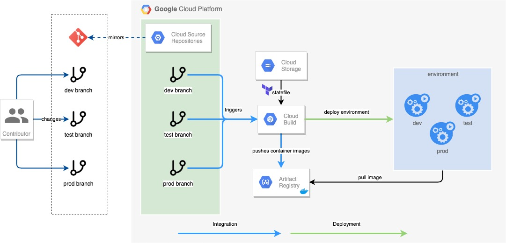

# 🚀 Cloud Build Bootstrap

This repository contains a prescriptive implementation of Cloud Build to bootstrap the creation of GCP resources that support the use of [GitOps-style Continuous Delivery](https://www.gitops.tech).

It also contains an example of how a code repository can be setup to support Continuous Deployment into multiple environments (e.g. `dev`, `prod` ) using Terraform.

## High-level Concept

The below diagram illustrates how this can be used to support a GitOp with possible integration with a [supported external repo](https://cloud.google.com/build/docs/automating-builds/create-manage-triggers).



## Prerequisites
* Google Cloud SDK
* Terraform version 0.13.7
* An existing Google Cloud organization
* An existing terraform service account (for service account impersonation)
* An existing Cloud Storage bucket for storing Terraform state


## Usage
1. Rename `terraform.example.tfvars` to `terraform.tfvars` and update the file with values from your environment
2. Run `terraform init`
3. Run `terraform plan`. Review the plan.
4. Run `terraform apply`.
5. Run `terraform output sourcerepo_url` to get URLs of the created Cloud Source Repositories.

**Note:** At this point, the following should have been deployed in your organization
* A GCP Project to contain the resources created
* A Cloud Source Repository for each  `source_repo` defined
* A Cloud Build trigger for each `branch_triggers` defined, per `source_repo`
* An artifact bucket for artifact storage (non-container images)
* An artifact registry for generated Docker containers


## Setting up your repository
You will need to set up your repository in the following structure:
```
example_repo/
└── environments/
    └── dev/
    └── prod/
└── modules/
    └── module1/
    └── module2/
    └── ...
```
* Each environment definition is contained in its own folder in `environments/'
* We make use of the reusability of Terraform modules to prevent drift between the environments.
* Terraform state is stored in a Cloud Storage bucket


## Deploying the example
**Note:** Instructions on how to clone a CSR can be found [here](https://cloud.google.com/source-repositories/docs/cloning-repositories).

1. Clone the Cloud Source Repository

2. Navigate into the repo `cd gcp_test_repo`

3. Create a `dev` branch
    ```sh
    git checkout -b dev
    ```
4. Copy contents of example_repo to the new repo
    ```sh
    cp -R ../cloud-build-bootstrap/example_repo/ .
    ```

5. Update `terraform.tfvars` to point to your dev and prod projects
    ```sh
    # for OSX, use sed -i '' 's/PROJECT_ID/...'
    sed -i 's/PROJECT_ID/<your_dev_project>/' /environments/dev/terraform.tfvars
    sed -i 's/PROJECT_ID/<your_prod_project>/' /environments/prod/terraform.tfvars
    ```

6. Update `backend.tf` to point to your state bucket
    ```sh
    sed -i 's/BUCKET_ID/<your_bucket_name/' /environments/dev/backend.tf
    sed -i 's/BUCKET_ID/<your_bucket_name/' /environments/prod/backend.tf
    ```

7. Commit changes
    ```sh
    git add .
    git commit -m 'initial commit`
    ```
8. Push your changes, this should fire off the trigger to deploy in your dev environment
    ```sh
    git push --set-upstream origin dev
    ```

9. ***Optional*** Make some changes to a module in the `dev` branch and commit the change

10. Merge changes to the `prod` branch. This should fire off the trigger for prod.
    ```sh
    git checkout -b prod
    git push --set-upstream origin prod
    ```


